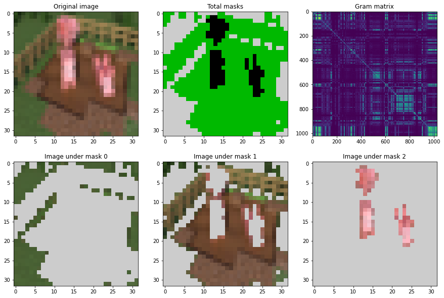

# :pig: PIGS :pig:
Readme for PIGS or Pixelwise Image Graph Segmentation project developmet.



## Basic information
[Official PIGS repo](https://github.com/veax-void/pigs)

Fast package for image segmentatioin using graphs, like your dad use to make! 

## Problem to solve

Pixelwised image segmentation based on recurseve graph partitioning.  
I propose to use fast lib based on cpp code for image to graph trarnslation and graph segmentation.

## How to run
Install BLAS and MKL

LIBS:
```
pip install numpy-hilbert-curve
pip install pybind11
```

```
cd source/
make
run test2.py
```


## Roadmap 
- [ ] 0\. PIGS
- [x] 01\. Flatter  
- [x] 02\. Gram computer
- [x] 03\. Degree-Laplace computer
- [x] 04\. Linear solver
    - [x] 041\. max(Degree)
    - [x] 042\. Drop from Degree & Laplace
    - [x] 043\. Actual solver
- [x] 05\. IsoRatio computer
    - [x] 051\. Construct new gram 
- [ ] 06\. Recursive part 